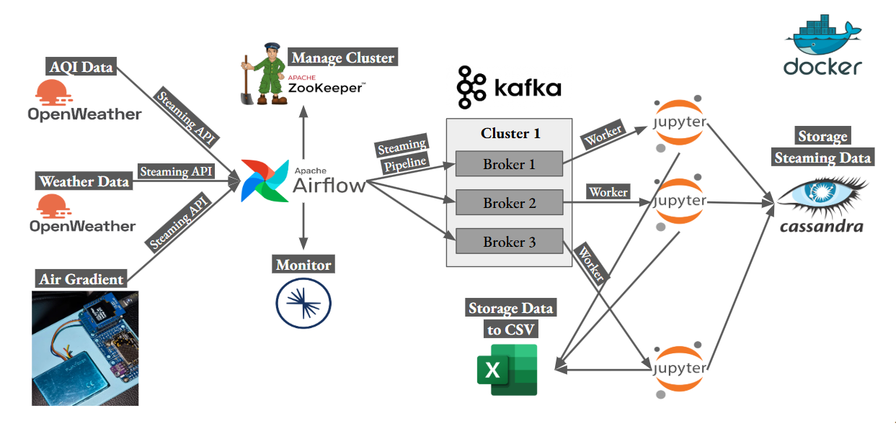

# Project Title

airpullution collecter

## Description



## Getting Started

### Installing

- Create your own virtual environment
- open docker-desktop

### Executing program

- open terminal
- select path to docker-compose folder
- run docker command

```
docker compose up
```

- If broker3 shows unhealthy, check Docker Desktop to ensure all containers are running properly.

* go to jupiter-notebook file
* select kernel for notebook (virtual environment)
* run all jupiter-notebook

## Authors

Kritsada Ruangthawee

## Acknowledgments

Inspiration, code snippets, etc.

- [awesome-readme](https://github.com/matiassingers/awesome-readme)
- [Yusuf Ganiyu](https://github.com/airscholar/e2e-data-engineering.git)
